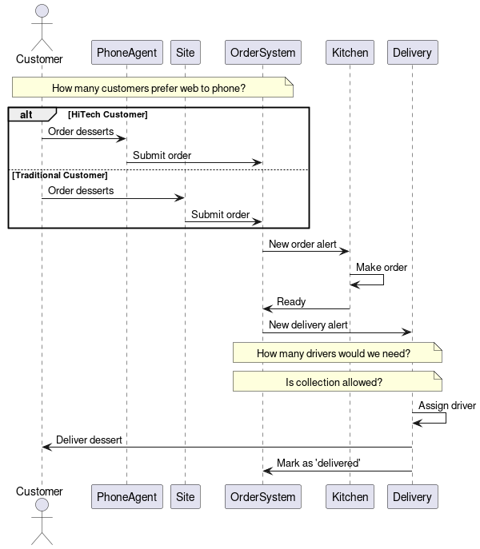
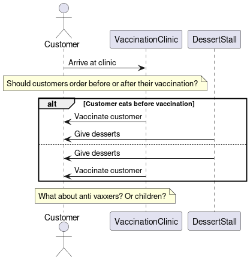

# notepad

[](https://github.com/laughingbiscuit/notepad/actions/workflows/pipeline.yml)

- This notepad is clever, not only does it give a practical example of lots of technologies - but any shell code blocks are run by github actions and must return 0 for CI to pass so you can trust it!
- Remember, GitHub lets you click a button to see the table of contents... TIL!


## Introducing... Perfect Pastries

> Using an applied example to demonstrate best practices, the business value of APIs
> and play with some cool technologies.

### Project Brief

A family of Italian/French heritage decided to open a dessert 
shop. They called it...

```txt
 ____            __           _     ____           _        _           
|  _ \ ___ _ __ / _| ___  ___| |_  |  _ \ __ _ ___| |_ _ __(_) ___  ___ 
| |_) / _ \ '__| |_ / _ \/ __| __| | |_) / _` / __| __| '__| |/ _ \/ __|
|  __/  __/ |  |  _|  __/ (__| |_  |  __/ (_| \__ \ |_| |  | |  __/\__ \
|_|   \___|_|  |_|  \___|\___|\__| |_|   \__,_|___/\__|_|  |_|\___||___/
                                                                        
```

They will sell two products, both family recipes.

- Crunchy Cannoli
- Exquisite Eclair

However, they were forced online during the coronavirus pandemic.

Let's help them keep their business alive.

## Design Sprint

Before committing too much time and money to the project, it is important
to align our stakeholders and test our solution with real users to ensure we are on 
the right track. We will use a [Design Sprint](https://letmegooglethat.com/?q=jake+knapp+design+sprint) for this,
including the business owners, bakers, front of house and myself.

### Day One - Understanding

Workshop outputs

```txt
Business Opportunity

- Whilst in lockdown, people are eating more desserts than ever
  - How long will the pandemic last?
  - If the pandemic drags on, will we need to create healthier options too?
- If we offered delivery, analysts predict 125 orders per week, a 25% increase
  - We will need to consider the capital expenditure required to build our site
  - We will need to consider the operating expenditure required to maintain a delivery network

Audience

- We can target existing customers on the east side of the village
- Prospective customers on the west side of the village, that historically wouldn't walk to us,
  can now be offered delivery
- In the past, we advertised the wrong pastries to people. We couldn't tell who liked cannoli and
  who liked eclairs. With new data, we should be able to provide people exactly what they want

Competition

- We are the only dessert shop in our village, but a supermarket is opening nearby
  - They don't offer cannoli, but their eclairs are pretty good
  - They don't offer delivery as visiting the supermarket is allowed under lockdown

Value Proposition

'The only desserts delivered to your door'

Success Metrics

- Number of visits to our site
- Number of desserts sold
- Number of referrals from blogs the local newspapers site
- Efficiency of delivery drivers


Problem Statement

"How do we keep the cannoli/eclair debate relevant during COVID"
```

### Day Two - Diverging/Exploring

Workshop outputs

```txt
Problem: "How do we keep the cannoli/eclair debate relevant during COVID"

Possible Solutions:

- Propose desserts as a COVID cure
- Deliver desserts to peoples doors
- Sell desserts at vaccination clinics
- Sell dessert recipes to allow customers to make them at home
- Create a DessertTV local radio station with 24 hr content
- Create a telephone service for customers with limited online access
```

### Day Three - Converging/Refining

Workshop outputs

```txt
Let's deeper dive into solutions that we see as viable

Solutions kept:

- Deliver desserts to peoples doors
- Create a telephone service for customers with limited online access
- Give away free desserts at vaccination clinics

```

Solution one: dessert delivery



Solution two: clinic pickup



### Day 4 - Prototyping - Converging/Refining

Workshop outputs

```txt
Prototype One: Web mockup

Hypotheses:
- Customers will be satisfied with an online delivery service
- Our customers prefer using the web to the phone
- We only need one driver
- Collection will not be allowed during lockdown

Prototype Two: Stand in carpark

Hypotheses:
- Customers will be satisfied with an online delivery service
- Our customers prefer using the web to the phone
- We only need one driver
- Collection will not be allowed during lockdown
```

Lo-fi Screen 1

```txt
 ____            __           _     ____           _        _           
|  _ \ ___ _ __ / _| ___  ___| |_  |  _ \ __ _ ___| |_ _ __(_) ___  ___ 
| |_) / _ \ '__| |_ / _ \/ __| __| | |_) / _` / __| __| '__| |/ _ \/ __|
|  __/  __/ |  |  _|  __/ (__| |_  |  __/ (_| \__ \ |_| |  | |  __/\__ \
|_|   \___|_|  |_|  \___|\___|\__| |_|   \__,_|___/\__|_|  |_|\___||___/

Tel: (939) 555-0113
                                                                        

What would you like to order?

Cannoli x[ 1]
Eclair  x[ 1]

What is your address?
[


]

Any additional notes?
[


]
  [Submit]
```

Lofi Screen 2

```txt

  Your order is on the way!

```

```txt
Prototype Two: Dessert stand in carpark

Hypotheses:
- Customers will be satisfied with a dessert after their vaccine
- The majority of our customer base will get vaccinated
- Customers will be allowed to eat in the waiting room

Experiment design:

When our friend went for her vaccination, we parked our car nearby and offered her a dessert.

Additional research:

We contacted the local radio station to poll the village on who wants to get vaccinated.
```

### Day 5 - Testing

We used our prototypes to test our ideas and interview our customers. Here are the results:

```txt
Hypotheses and result:

Customers will be satisfied with an online delivery service 
  True - customers loved the idea, but would have liked order tracking when waiting for delivery

Our customers prefer using the web to the phone
  True - there is only one person in the village without internet

We only need one driver
  True - our customers live close to one another and do not have an expectation of instant delivery

Collection will not be allowed during lockdown
  False - key workers will be allowed to collect, but an open shop may cause a scandal...


Customers will be satisfied with a dessert after their vaccine
  False - customers lost their appetite and felt queasy

The majority of our customer base will get vaccinated
  True - but a lot less often than they buy desserts...

Customers will be allowed to eat in the waiting room
  False - eating and drinking is not allowed 

```

### Design Sprint Conclusion

__We will build a web interface to order desserts for delivery with an order tracker__

Designs sprints are intense, but now we have explored our options,
aligned with stakeholders and validated our solution. Now we can start building.

## Environment Setup

Lets check if our dependencies are installed

```bash
which kubectl
which helm
which kind
```

Lets create a multi-node kind cluster

```bash
kind create cluster --config - <<EOF
kind: Cluster
apiVersion: kind.x-k8s.io/v1alpha4
nodes:
- role: control-plane
- role: worker
- role: worker
- role: worker
networking:
  disableDefaultCNI: true
EOF

kubectl cluster-info --context kind-kind
```

Lets install Cilium

```bash
helm repo add cilium https://helm.cilium.io/
docker pull quay.io/cilium/cilium:v1.13.0
kind load docker-image quay.io/cilium/cilium:v1.13.0
helm install cilium cilium/cilium --version 1.13.0 \
   --namespace kube-system \
   --set image.pullPolicy=IfNotPresent \
   --set ipam.mode=kubernetes
```

Now lets install the cilium cli and check everything works

```bash
CILIUM_CLI_VERSION=$(curl -s https://raw.githubusercontent.com/cilium/cilium-cli/master/stable.txt)
CLI_ARCH=amd64
if [ "$(uname -m)" = "aarch64" ]; then CLI_ARCH=arm64; fi
curl -L --fail --remote-name-all https://github.com/cilium/cilium-cli/releases/download/${CILIUM_CLI_VERSION}/cilium-linux-${CLI_ARCH}.tar.gz{,.sha256sum}
sha256sum --check cilium-linux-${CLI_ARCH}.tar.gz.sha256sum
sudo tar xzvfC cilium-linux-${CLI_ARCH}.tar.gz /usr/local/bin
rm cilium-linux-${CLI_ARCH}.tar.gz{,.sha256sum}

cilium status --wait
cilium connectivity test
kubectl cluster-info --context kind-kind
kubectl get nodes
```

Next up.. Istio

```bash
helm repo add istio https://istio-release.storage.googleapis.com/charts
helm repo update
helm install istio-base istio/base -n istio-system --create-namespace
helm install istiod istio/istiod -n istio-system --wait
helm ls -n istio-system
helm status istiod -n istio-system
kubectl label namespace default istio-injection=enabled
curl https://raw.githubusercontent.com/istio/istio/master/samples/bookinfo/platform/kube/bookinfo.yaml | kubectl apply -f -
while ! kubectl exec "$(kubectl get pod -l app=ratings -o jsonpath='{.items[0].metadata.name}')" -c ratings -- curl -sSf productpage:9080/productpage | grep -o "<title>.*</title>"; do sleep 5; echo -n "."; done
kubectl get svc
kubectl get po
kubectl exec "$(kubectl get pod -l app=ratings -o jsonpath='{.items[0].metadata.name}')" -c ratings -- curl -sS productpage:9080/productpage | grep -o "<title>.*</title>"
```
Gloo

<!-- https://docs.solo.io/gloo-edge/latest/getting_started/ -->

```bash
helm repo add gloo https://storage.googleapis.com/solo-public-helm
helm repo update

helm install gloo gloo/gloo -n gloo-system --create-namespace
sleep 30
kubectl get all -n gloo-system

```

